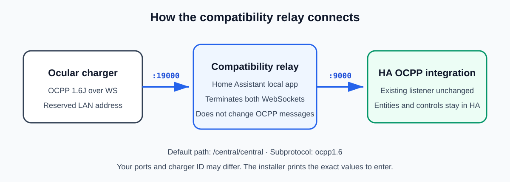
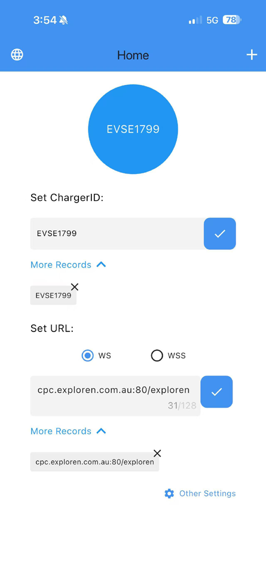
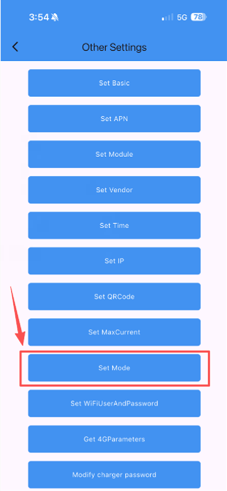
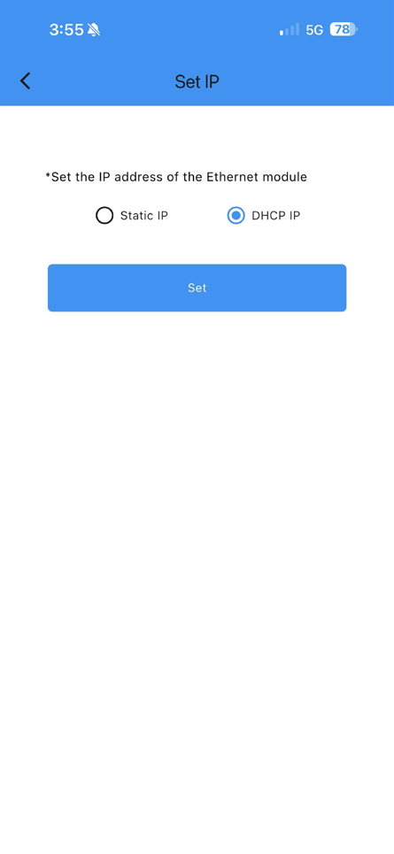
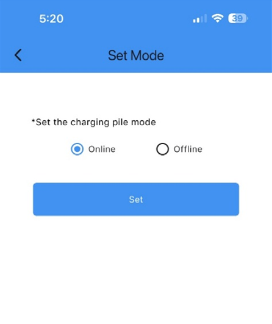
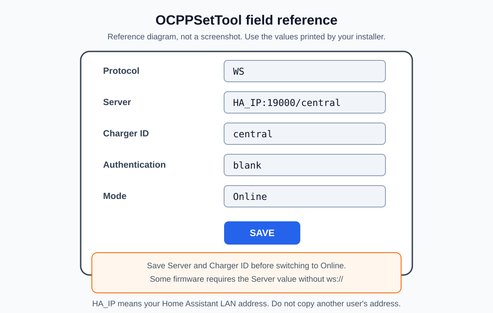

# Ocular LTE Plus V3 OCPP compatibility relay

[](https://github.com/matiebird/ocular-ocpp-compatibility-relay/actions/workflows/test.yml)

This package installs a small Home Assistant app that sits between an Ocular LTE Plus V3 charger and Home Assistant's OCPP integration.

It is for chargers that repeatedly drop or fail their WebSocket connection when talking directly to Home Assistant.

## What it does

```text
Ocular charger
  -> Home Assistant host port 19000
  -> this compatibility relay
  -> existing Home Assistant OCPP port 9000
```

The relay uses Python `websockets==12.0` for the charger-facing connection and opens a separate connection to Home Assistant. It does not translate OCPP or change charging commands. Both sides still use WebSocket RFC 6455 and OCPP 1.6J.

The existing Home Assistant OCPP listener stays where it is. The installer does not edit `.storage`, Home Assistant's OCPP integration, automations, scripts or charger controls.

## Requirements

- Home Assistant OS or Home Assistant Supervised
- Advanced SSH or Web Terminal app
- Home Assistant OCPP integration already running, normally on port 9000
- Ocular charger on wired Ethernet with a reserved DHCP address
- Charger configured for OCPP 1.6J over plain `WS` on a trusted home LAN

Supported Home Assistant host architectures:

- aarch64
- amd64

## Installation prerequisites

The setup requires access to:

1. The router's device list, to identify the charger and Home Assistant LAN addresses.
2. Home Assistant's Advanced SSH & Web Terminal app, to run the installer command.
3. [OCPPSetTool for Android](https://play.google.com/store/apps/details?id=com.evsemaster.ocppset) or [OCPPSetTool for iPhone](https://apps.apple.com/au/app/ocppsettool/id6504644430), to enter the values printed by the installer.

The installer does not require Python, Docker or Home Assistant internal-storage edits. Changing the physical charger's endpoint remains a separate OCPPSetTool step and cannot be automated by a Home Assistant app.



Before starting, write down:

```text
Charger IP:       ____________________
Home Assistant IP: ____________________
Current charger OCPP server: ______________________________
```

Keep the current OCPP server value so you can restore it if needed.

## Install

### 1. Copy and extract the ZIP

Download the latest `ocular-ocpp-easy-deploy` ZIP from the [GitHub releases page](https://github.com/matiebird/ocular-ocpp-compatibility-relay/releases/latest). Put the ZIP in `/config`, then extract it. The folder should be:

```text
/config/ocular-ocpp-easy-deploy/
```

### 2. Run the installer

Open Advanced SSH or Web Terminal and run:

```bash
bash /config/ocular-ocpp-easy-deploy/install.sh CHARGER_IP HOME_ASSISTANT_IP
```

Example:

```bash
bash /config/ocular-ocpp-easy-deploy/install.sh 192.168.1.50 192.168.1.10
```

The defaults are:

```text
Charger ID: central
Home Assistant OCPP port: 9000
Relay port: 19000
Expected path: /central/central
```

If your charger ID or Home Assistant OCPP port is different:

```bash
bash /config/ocular-ocpp-easy-deploy/install.sh CHARGER_IP HOME_ASSISTANT_IP CHARGE_POINT_ID HA_OCPP_PORT
```

Example:

```bash
bash /config/ocular-ocpp-easy-deploy/install.sh 192.168.1.50 192.168.1.10 driveway 9000
```

The installer checks the IP addresses and existing OCPP listener, backs up an older relay outside Supervisor's `/addons` scan tree, installs the local app, verifies that it is started and listening, and prints the exact charger settings. If a reinstall fails after removing the previous version, it automatically attempts to restore and restart that version.

### 3. Change the charger endpoint

For the default `central` ID, set OCPPSetTool to:

```text
Protocol: WS
Server: HOME_ASSISTANT_IP:19000/central
Charger ID: central
Authentication: blank, unless you configured it yourself
Mode: Online
```

Save the server and charger ID before setting Online mode.

Some Ocular firmware requires the server field without `ws://`. The example above intentionally omits it.

#### Actual OCPPSetTool screens

These are genuine OCPPSetTool interface captures reproduced from Ocular's official [LTE Plus v3 OCPP configuration guide](https://evse.com.au/wp-content/uploads/LTE-Plus-v3-OCPP-configuration-guide.pdf), not recreated mock-ups.

> **Do not copy the charger ID or Exploren server shown in the first screenshot.** They are Ocular's example values. Enter the exact charger ID and server printed by this installer's output.

**1. Main screen — set Charger ID, select `WS`, enter Server, and tap each blue tick to save**



**2. Open `Other Settings`**



**3. Open `Set IP`, select `DHCP IP`, then tap `Set`**



**4. Open `Set Mode`, select `Online`, then tap `Set`**



The screen layout may differ slightly between Android, iPhone and app versions. The controls and field names above are the ones used by the Ocular LTE Plus v3 guide.

For a compact value-only view, use this labelled reference:



## Check that it connected

Run:

```bash
ha apps logs local_ocular_ocpp_compatibility_relay
```

A good connection shows:

```text
connection_open
```

Home Assistant should then receive a fresh BootNotification and heartbeat. The connector should become `Available` or `Preparing`, with `NoError`.

If you do not see `connection_open`, do not keep changing settings at random. Check that:

- the charger address entered in the installer matches the charger in your router;
- the Home Assistant address entered in OCPPSetTool is correct;
- the server uses port `19000` and has no `ws://` prefix;
- the charger ID and path match the values printed by the installer;
- the compatibility relay app is started.

Do not treat one successful command after reboot as proof. Leave it connected for a few minutes and try `ocpp.get_configuration` more than once before relying on it.

## Recommended charger timing

The supplied `ha-timing-script.yaml` sets and reads back:

```text
HeartbeatInterval = 60
WebSocketPingInterval = 60
MeterValueSampleInterval = 10
```

Paste it into a Home Assistant script. Change this line if your OCPP device ID is not `ocular`:

```yaml
ocpp_device_id: ocular
```

Run the script only after the charger is connected. Read the values back again after a Soft Reset or power cycle because this firmware may reset `HeartbeatInterval` to `3600`.

## Everyday Home Assistant controls

For a simple charger dashboard, use the generic examples in [`examples/README.md`](examples/README.md):

- [`examples/ocular-everyday-controls.yaml`](examples/ocular-everyday-controls.yaml) — Start, transaction-preserving Pause, same-session Resume, final Stop, current selection, optional sustained-taper finishing and fault notification.
- [`examples/ocular-dashboard-card.yaml`](examples/ocular-dashboard-card.yaml) — a dashboard built only from standard Home Assistant cards.

These examples are intentionally independent of any particular home's solar, tariff or battery policy. Automatic finishing is disabled until the user enables it, and routine reset controls are deliberately excluded.

## Charger control workarounds

The connection relay is only one part of a reliable installation. See [Ocular charger control workarounds](CHARGER_CONTROL_WORKAROUNDS.md) for the field-tested transaction and recovery rules:

- transaction-preserving 0 A hold and same-transaction resume;
- safe handling of delayed OCPP replies and ambiguous timeouts;
- sustained terminal-taper completion;
- explicit Hard Reset for exceptional command-unresponsive recovery;
- one serialized normal command authority.

The guide includes the tested OCPP profile shape and verification boundaries. The relay itself does not send charging or reset commands.

## Test charging

First test while the car can accept charge and someone is present:

1. Set 6 A while charging is off.
2. Start with the normal Home Assistant OCPP control.
3. Confirm real current and power.
4. Increase the current.
5. Wait about 60 seconds before another routine current change.
6. Reduce to 6 A and confirm the current falls.
7. Stop normally and confirm zero current and power.

Do not judge success from a service call alone. Use fresh charger current and power.

## Remove it

Run:

```bash
cd /config/ocular-ocpp-easy-deploy
bash uninstall.sh HOME_ASSISTANT_IP
```

Example:

```bash
bash uninstall.sh 192.168.1.10
```

The uninstaller removes only this relay. It does not edit Home Assistant's OCPP integration. It prints the direct charger endpoint to restore in OCPPSetTool.

## Limits

This is a compatibility workaround, not an Ocular firmware update.

It can give the charger a WebSocket connection it handles more reliably and allow automatic recovery from brief reconnects. It cannot repair a charger connection attempt that never sends enough of an opening request to classify safely, and it cannot fix firmware that sends heartbeats but later ignores OCPP commands.

If the OCPP channel is alive but the charger is genuinely command-unresponsive, the tested firmware responded more reliably to an explicit Hard Reset than Soft Reset. Do not reset it merely for `Finishing`, `SuspendedEV`, `SuspendedEVSE`, zero current or one delayed response. If the OCPP channel is dead, no OCPP Reset command can travel over it; follow the charger's electrical safety and dedicated isolation procedure. After recovery, require BootNotification, heartbeat, a usable connector state and `NoError` before charging.

## Security boundary

The app:

- accepts only the configured charger IP;
- accepts only the configured path and `ocpp1.6` subprotocol;
- runs without host networking, privileges or full Home Assistant access;
- drops Linux privileges inside the container;
- limits queues, handshake buffers and complete application-message size;
- does not log OCPP frames, credentials or WebSocket keys;
- does not generate OCPP commands.

## Optional support

This workaround is free to use. If it saved you time and you would like to support further testing and documentation, you can optionally [leave a tip or donation on Ko-fi](https://ko-fi.com/matiebird).

Support is entirely optional. It does not affect access to the software, documentation, updates or community help.

## Source and licence

Source code, tests and releases are available at [matiebird/ocular-ocpp-compatibility-relay](https://github.com/matiebird/ocular-ocpp-compatibility-relay). This project is provided under the MIT License.
